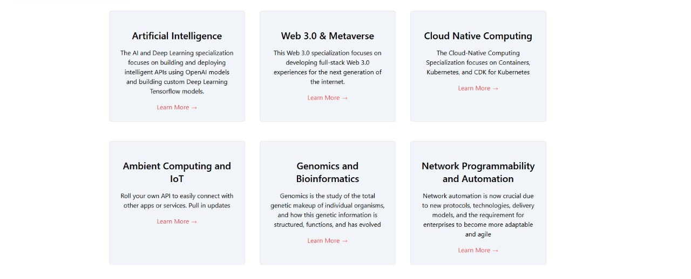

## Data fetching Assignment

You need to create an assignment by fetching data from the below api and show it in the cards grid like
mentioned in the screenshot. The data should be fetched by using both approaches client side and server side.

1. For client side data fetching use this api: https://jsonplaceholder.typicode.com/photos
2. For server side data fetching use this api: https://simple-books-api.glitch.me/books/

All of the requirements are mentioned above so please stick for the api's which are mentioned for doing the
assignment and for creating the grid u.i use tailwind css. The assignment should look professional. I am leaving
the design part on you but the assignment should contain a nav-bar and it should be responsive on all screen sizes.

### Deadline: 25-Dec-2024